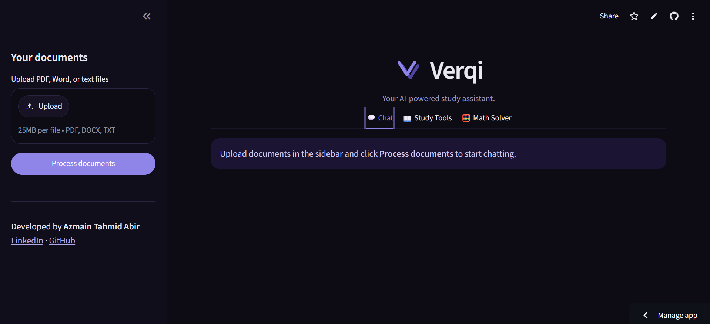
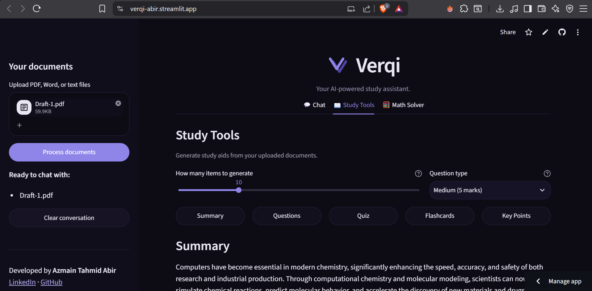
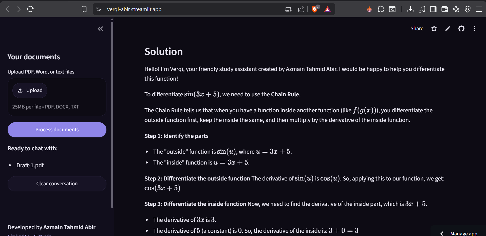
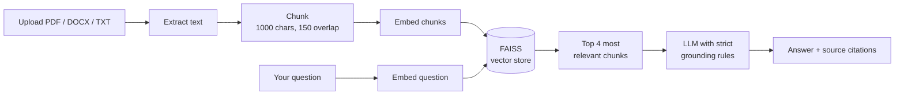

<p align="center">
  
</p>

<p align="center">
  
  
  
  
  
  
</p>

<p align="center">
  <b><a href="https://verqi-abir.streamlit.app">🚀 Live Demo</a></b>
</p>

---

## What is Verqi?

Verqi is an AI study assistant that answers questions **from your own documents** — not from the internet, and not from memory.

Upload your lecture notes, textbook chapters, or research papers, and Verqi will answer questions about them, **showing the exact passages each answer came from**. If the answer isn't in your documents, it says so instead of inventing one.

It also turns those documents into study material: summaries, exam questions with model answers, quizzes, and flashcards. And it solves math problems — typed or photographed — with step-by-step working.

## Features

### 💬 Grounded document chat
- Upload multiple **PDF, DOCX, or TXT** files at once
- Ask questions in plain English and get answers **drawn only from your documents**
- **Source citations** on every answer — see the exact passages used
- **No hallucination**: replies "I couldn't find that in your documents" when the answer isn't there
- **Streaming responses** and conversational follow-ups
- **Multi-language**: ask in any language, get answers in that language

### 📖 Study tools
- **Summary** — a concise overview of the material
- **Questions & Answers** — exam-style questions with model answers, weighted by marks (1 / 5 / 8 / mixed)
- **Quiz** — multiple-choice questions with hidden answers and explanations
- **Flashcards** — key terms and definitions for revision
- **Key Points** — the most important concepts extracted
- Adjustable set size (5–25 items)

### 🧮 Math solver
- Solve problems **typed in or photographed** (multimodal input)
- Step-by-step worked solutions, not just final answers
- Handles arithmetic, algebra, calculus, and word problems

## Screenshots

| Chat with sources | Study tools |
|---|---|
|  |  |

<p align="center">
  
</p>

## How it works

Verqi uses **RAG (Retrieval-Augmented Generation)**. Rather than sending a whole document to a language model, it retrieves only the passages relevant to your question — which is what makes answers accurate, fast, and citable.



**Engineering decisions worth noting:**

- **Single retrieval per query** — the answer and its citations share one vector search, halving embedding API calls and latency.
- **Automatic retry with exponential backoff** — transient rate limits and network blips recover silently instead of erroring.
- **Native JSON mode** for structured output (quizzes, flashcards), with a defensive parser as a fallback.
- **Clean text kept separate from chunks** — study tools read the original text, not the overlap-duplicated chunks.
- **Upload size guard** — caps chunk count to protect the shared API quota.
- **Friendly error handling** — users see plain-language messages; full details go to server logs.

## Tech stack

| Layer | Technology |
|---|---|
| UI | Streamlit |
| RAG orchestration | LangChain |
| Embeddings & LLM | Google Gemini API |
| Vector store | FAISS |
| Document parsing | pypdf, docx2txt |
| Deployment | Streamlit Cloud |

## Getting started

### Prerequisites
- Python 3.12
- A free Gemini API key from [Google AI Studio](https://aistudio.google.com)

### Installation

```bash
git clone https://github.com/azmainabir/verqi.git
cd verqi

python -m venv venv
source venv/bin/activate        # Windows: .\venv\Scripts\Activate.ps1

pip install -r requirements.txt
```

### Configuration

Create a `.env` file in the project root:

```
GOOGLE_API_KEY=your_api_key_here
```

### Run

```bash
streamlit run app.py
```

The app opens at `http://localhost:8501`.

### Deploying

On Streamlit Cloud, skip the `.env` file and add your key under **Advanced settings → Secrets** in TOML format:

```toml
GOOGLE_API_KEY = "your_api_key_here"
```

## Project structure

```
verqi/
├── app.py                    # Streamlit UI — chat, study tools, math solver
├── rag_engine.py             # Retrieval, generation, error handling
├── document_processor.py     # Text extraction, chunking, embedding, FAISS
├── study_tools.py            # Summaries, questions, quizzes, flashcards
├── math_solver.py            # Text and image math solving
├── requirements.txt          # Pinned dependencies
├── .streamlit/
│   └── config.toml           # Theme configuration
└── assets/
    └── verqi_icon.png        # App icon
```

## Roadmap

- [ ] Cache embeddings so repeat uploads skip re-processing
- [ ] Export chat and study material to PDF
- [ ] Chunked generation for full coverage of very large documents
- [ ] Per-document removal without full reprocessing

---

<p align="center">
  Developed by <b>Azmain Tahmid Abir</b><br>
  <a href="https://www.linkedin.com/in/azmain-abir">LinkedIn</a> ·
  <a href="https://github.com/azmainabir">GitHub</a>
</p>
